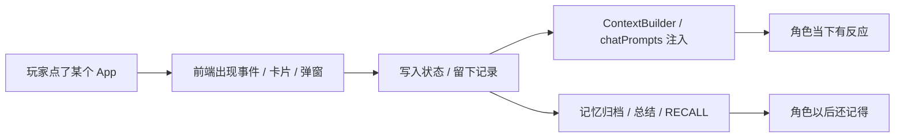

# SullyOS

> 写给准备把这个小手机抱回家的人。  
> 也写给准备二改它、继续把它宠坏的人。  
>   
> 如果你只是路过，现在装作没看见也还来得及。  
> 如果你已经点进来了，那就进门。  
> 鞋脱不脱随你，别踩我数据就行。

---

## 这到底是什么东西

SullyOS 不是那种“打开以后只有一个输入框，然后温柔地问你今天过得怎么样”的聊天壳。  
它更像一台已经长歪了的小手机。

它会：

- 聊天
- 打电话
- 写日记
- 留记忆
- 长世界书
- 自己跑剧情
- 被你越改越离谱

你可以把它当：

- 一个角色陪伴项目
- 一个多 app 恋爱脑手机
- 一个会自己给自己加戏的前端玩具箱
- 一个本来想只做聊天，结果后来越长越多的赛博小屋

反正别把它当普通聊天机器人界面。  
那样太小看它了，也太小看你准备搞出来的烂漫大工程了。

---

## 先别急着改，先看这手机能玩什么

### 陪伴主线

| App 名字 | 平时拿来干嘛 | 很适合长什么戏 |
| --- | --- | --- |
| `Message` | 主聊天窗 | 谈恋爱、吵架、发疯、深夜回忆杀、突然很乖 |
| `电话` | 语音通话 | 更贴脸的陪伴感、声线演出、通话气氛 |
| `群聊` | 多人互动 | 修罗场、朋友局、小团体阴阳怪气 |
| `见面` | 从聊天走到现实相处 | 约会、散步、冲突、和好、卡壳 |
| `特别时光` | 高光节点 | 纪念日、限定事件、关系大跨步 |
| `时光契约` | 主动消息那条线 | 定时来找你、未来提醒、隔一阵子犯贱 |

### 生活感和碎片感

| App 名字 | 平时拿来干嘛 | 很适合长什么戏 |
| --- | --- | --- |
| `小小窝` | 角色房间 | 装修、摆家具、堆生活痕迹 |
| `查手机` | 偷看到一点什么 | 半截线索、碎片日常、让人脑补半小时 |
| `交换日记` | 长期陪伴记录 | 细水长流、你来我往、关系慢慢发酵 |
| `相册` | 图和纪念物存档 | 留档、纪念、截图考古 |
| `Spark` | 动态流 | 朋友圈感、公开面、碎碎念 |
| `自由活动` | 角色自己出去晃 | 不算正餐，但很下饭的生活碎片 |
| `小红书图库` | 素材和图包池 | 发帖配图、灵感图、图包收藏 |

### 设定、剧情、创作线

| App 名字 | 平时拿来干嘛 | 很适合长什么戏 |
| --- | --- | --- |
| `神经链接` | 角色后台总控台 | 设定、记忆、印象、世界书挂载 |
| `世界书` | 世界观和 lore | 门派规则、背景设定、补丁包 |
| `攻略本` | 带流程和结算的玩法 | 跑团、章节、互动事件 |
| `笔友会` | 文字创作 | 通信体、共创、互写 |
| `写歌` | 情绪型创作 | 合作写词、纪念曲、抒情发疯 |
| `自习室` | 学习陪伴 | 资料拆解、课程辅助、一起卷 |
| `TRPG` | 共玩式玩法 | 冒险、乱跑、一起把剧情带沟里 |
| `都市人生` | Drama 大本营 | 吃瓜、事件流、角色们自己的人生闹剧 |

### 外观和系统层

| App 名字 | 平时拿来干嘛 |
| --- | --- |
| `外观` | 整体系统长什么样 |
| `气泡工坊` | 聊天气泡、消息样式、头像显示细节 |
| `档案` | 你的资料页 |
| `设置` | API、备份、导入导出、主动消息 2.0 |
| `使用帮助` | 给普通玩家看的答疑页 |

---

## 如果你第一次打开，不知道先摸哪

那我替你排一下顺序：

1. 先开 `Message`，看角色说话顺不顺、活不活。
2. 再去 `神经链接`，看看这角色脑子里到底装了什么。
3. 想要生活感，就开 `小小窝`、`交换日记`、`Spark`。
4. 想要玩法感，就开 `攻略本`、`TRPG`、`都市人生`。
5. 想搞皮肤和审美，就去 `外观` 和 `气泡工坊`。

> 看我写一万句，不如你自己乱点十分钟。  
> 真的。  
> 这手机很多地方就是要你自己戳一下，它才肯把尾巴露出来。

---

## 好了，轮到你了：二改别一上来就举刀乱砍

先记住这句。很有用。以后会救你命。

```text
一个新功能 ≈ 前端入口 + 提示词/规则 + 状态数据 + 一次上下文注入
```

翻译一下：

- 用户得先在前端看到它。
- 角色得知道这件事发生了。
- 这件事得有地方存。
- 存完以后，还得能被后续聊天、总结、主动消息继续读到。

所以二改时，先别急着问：

> “这个功能该加在哪个组件里？”

先问这四句：

1. 用户会在前端看到它叫什么？
2. 角色是立刻知道，还是以后慢慢记住？
3. 这是短期上下文，还是长期记忆？
4. 它以后值不值得被别的功能继续读到？

问完这四句，你下手会稳很多。  
不然很容易做出一个“当场很热闹，过后查无此事”的功能。那就很气。

---

## `神经链接` 其实就是角色脑子的大门

很多人二改卡住，不是因为不会写页面。  
是因为功能虽然做出来了，但角色没有真的“吃进去”。

然后你就会收获一种非常经典的痛苦：

- 当下能回
- 第二天失忆
- 关系像白谈
- 剧情像白跑
- 你像白忙

`神经链接` 这条线基本就是角色后台。它大概管这些：

- 角色名字、口吻、默认人设
- 世界观和补充设定
- 角色怎么看用户
- 长期记忆和详细回忆
- 挂到角色身上的 `世界书`
- 情绪底色和额外注入

这些最后不是各玩各的。  
它们会被统一拼进角色上下文里。  
所以很多 app 表面上像各自有各自的玩法，真正让角色“像一个连续活着的人”的，是同一套脑内底座。

### 真要找源头，看这几块就够了

- [`utils/context.ts`](./utils/context.ts)：统一拼角色上下文的地方
- [`utils/chatPrompts.ts`](./utils/chatPrompts.ts)：聊天主提示词和额外注入
- [`context/OSContext.tsx`](./context/OSContext.tsx)：全局状态、角色更新、app 级操作怎么接起来
- [`components/chat/MessageItem.tsx`](./components/chat/MessageItem.tsx)：聊天卡片、特殊消息、文本清洗最后怎么显示

> 不用通读。  
> 真的不用。  
> 你只要知道，出了事该去翻哪几个抽屉，就已经赢过很多硬莽的人了。

---

## 这套脑回路，差不多长这样



这图不花哨，但很好用。  
你以后每做一个新功能，都可以拿它对照一下：

- 你现在只做到了 `B`？
- 还是已经做到 `D`？
- 还是终于做到了 `G`？

很多玩法之所以“像样”，不在于它能显示出来。  
而在于它后来还能被记住。

---

## 统一思路就一句：别把所有东西都硬塞进聊天框

如果一个新功能想让角色真的“懂了”，常见做法不是往聊天里塞一句系统提示然后开始祈祷。

更稳的分层一般是：

| 你想让它成为什么 | 更适合塞哪里 |
| --- | --- |
| 角色底色 | `神经链接` 的人设、世界观、世界书 |
| 长期关系资产 | 记忆系统 |
| 这一阵子的即时影响 | 聊天时的上下文注入 |
| 情绪反应 | 情绪底色或 buff 注入 |

你要是把所有东西都塞进一个超长 system prompt，最后大概率会收获：

- 难改
- 难查
- 难维护
- 难知道到底哪句起了作用
- 难得想掐死昨天的自己

所以能分层就分层。  
别给未来的你投毒。

---

## 记忆不是垃圾桶，记忆是这个项目最值钱的资产之一

这项目里的记忆，大概有这几层：

| 名字 | 大概是什么 | 平时干嘛 |
| --- | --- | --- |
| `memories` | 更细的碎片记录 | 按天留痕、保留细节 |
| `refinedMemories` | 更浓一点的月度总结 | 稳定长期记忆、给角色“记住重点” |
| `activeMemoryMonths` | 当前允许翻出来细看的月份 | 真要翻旧账时精确调回忆 |

所以它不是“把所有旧聊天全喂给 AI”。  
更像是：

1. 先把一大坨聊天整理成可读碎片。
2. 再把碎片压成更稳的长期记忆。
3. 真要翻旧账，再调某个月的详细回忆。

### 玩家入口本来就有，别浪费

- 在 `Message` 里可以做“记忆归档”
- 在 `神经链接 > 角色 > 记忆` 里可以做“批量总结”
- 也可以直接用“导入/清洗”把乱序文本整理成记忆档案

### 所以你做新玩法时，最常见的正确姿势是

- 不要只把结果显示在 UI 里
- 顺手给它留一份能入库的记忆文本
- 或者先出结构化结果，再转成记忆文本
- 重要内容进 `refinedMemories`
- 可追溯细节进 `memories`

不然今天轰轰烈烈，明天角色一脸“有这事吗”。  
你会很想把手机从楼上扔下去。

### 一个很常用的记忆清洗思路

先别急着让模型抒情。  
先让它把东西老老实实整理成规整结构，比如：

```json
[
  {
    "date": "2026-03-22",
    "summary": "今天一起在小小窝里折腾房间，最后因为窗帘颜色吵了两句又和好了。",
    "mood": "暧昧"
  }
]
```

先把脏文本拧成正常 JSON，后面你爱做卡片、爱做总结、爱入记忆库，都顺。  
一开始就让模型自由发挥，经常会给你一锅热乎的漂亮废话。

还有一件事别忘了：  
这项目本来就留了 `RECALL` 那条动作位。  
所以你做新玩法时，可以顺手问一句：

> 这件事以后值不值得被角色自己翻出来重提？

值的话，就别只让它漂在当下。

---

## JSON、聊天卡片、清洗，这仨其实是一家人

很多二改作者会卡在这一步。

功能明明做出来了。  
用户也看到了。  
但后面角色读不懂、总结读歪、上下文越来越脏，像把装修废料全扫床底下。

问题往往就在这里：

> 给用户看的东西，不一定适合直接再喂回模型。

更稳的链路一般是：

1. 先让模型吐结构化结果，比如 JSON。
2. 前端把 JSON 渲染成卡片、结算块、附件区。
3. 如果这个东西之后还要参与聊天、记忆、总结，就再留一份干净的人话文本。

直接记成一句也行：

```text
玩法结果 -> JSON -> 前端卡片 -> 干净文本 -> 记忆 / 总结 / 后续上下文
```

这项目里不少东西其实都走这路子，比如：

- `攻略本` 的结算卡
- `都市人生` 的结算卡
- 聊天里的系统卡片、引用、特殊消息

### 为什么清洗这一步不能偷懒

因为原始内容里经常会混着这些东西：

- 双语分隔标记
- 旧格式遗留
- 语音标签
- 多余 markdown
- 给 UI 专用的特殊标识

这些东西你不清，短期只是看着乱。  
长期会变成：

| 你偷懒不清 | 后面会发生什么 |
| --- | --- |
| 文本里带脏标记 | 总结读歪 |
| 结构不规整 | 记忆入脏 |
| 语音标签没处理 | TTS 乱念 |
| 卡片原文直接回喂 | 上下文越来越像垃圾填埋场 |

所以“清洗”不是装饰。  
它是功能链路本体的一部分。  
不清，后面全跟着脏。

---

## 给二改作者的提示词思路：别写论文，写能用的

如果你平时主要靠 vibe coding，那最该记住的不是术语，是：

**这段提示词到底想让模型干什么。**

### 1. 你想让角色“带着设定活”

这种不要只做成一轮对话里的临时补丁。  
更适合进 `神经链接`、`世界书`，或者最后能被 `ContextBuilder` 吃进去。

你通常真正想写的无非这些：

- 你是谁
- 你和用户现在是什么关系
- 你默认知道哪些世界规则
- 你会被什么触发情绪
- 你说话到底是哪种活人味

### 2. 你想让一段经历以后还能被用

那就别让模型只回一大段漂亮废话。  
更适合要求它：

- 整理
- 归档
- 结构化
- 按日期输出
- 只保留可复用的关键信息

一句话总结：

> 能记的东西，先写成能记的样子。

### 3. 你想做一个 app 感很强的新玩法

别一口气让模型同时写：

- UI 文案
- 旁白
- 卡片内容
- 结算
- 后续记忆

这样很容易乱成一锅。

更顺的做法通常是：

1. 先让模型产出结构化结果
2. 再让前端把结果渲染成卡片、面板、附件区

你要改视觉，就改前端。  
你要改入库逻辑，就改结构化结果。  
大家互相别绊脚。

### 4. 你想让以后别读脏上下文

那就从一开始分清：

- 这段文本是给用户看的
- 还是给系统以后继续读的

这两份东西经常就不该长一样。  
如果它后面还要进聊天、总结、TTS、主动消息，那就尽量让它：

- 短一点
- 准一点
- 干净一点
- 少一点格式污染

写得花里胡哨很爽。  
但能被反复复用，才是真的赚。

---

## 很多新功能，说白了就是在找“注入点”

别总想着“我要做个全新大系统”。  
很多时候你真正要找的，只是这东西到底该从哪一层塞进去。

常见注入点差不多就这些：

- `ContextBuilder`：给所有会读角色上下文的地方统一加料
- `chatPrompts`：给聊天单独加规则、动作、实时信息、外部内容
- 聊天卡片：先让玩法在聊天里出现，再决定要不要沉淀成记忆
- 世界书挂载：让设定稳定存在，而不是一次性口头提一句
- 记忆归档：让当下体验变成以后还能翻出来的旧账

判断方法也很简单：

| 你想要什么效果 | 常见做法 |
| --- | --- |
| 只影响这一轮 | 即时注入 |
| 角色以后一直带着 | 进 `神经链接` 或 `世界书` |
| 变成共同经历 | 进记忆 |
| 先给用户完整反馈 | 先出 JSON / 卡片 |

别把注入点找错。  
找错了你会得到一种非常熟悉的痛苦：

> “怎么哪里都像能改，哪里都改不顺？”

嗯，对，就是那种。

---

## 如果你主要靠 vibe coding，最建议先改这几刀

别一上来就摸全局底层。  
先改这些，出效果最快：

- [ ] 角色提示词和世界观  
先从 `神经链接` 里的角色设定、关系、口吻、世界观下手。想让角色更会爱、更会吵、更会装死、更会吃醋，这一刀最直。

- [ ] 世界书挂载  
校园、娱乐圈、末世、修仙、门派、公司、宿舍、宇宙飞船，都适合走 `世界书`。这是补设定，不是把 lore 一锅端进人设正文。

- [ ] 记忆归档提示词  
如果你觉得角色“会聊，但不会记”，很多时候锅不在主聊天，在记忆归档太空、太泛、太流水账。改好这块，角色后劲会明显强很多。

- [ ] 卡片输出  
新玩法想更像真的 app，就别只让模型吐一整段大白话。先让它回结构化结果，再做聊天卡片、结算卡、附件卡，观感会立刻上去。

- [ ] 上下文管理  
聊天越来越贵、越来越慢、越来越乱，不一定是模型不行。先看看是不是上下文喂太多了。项目里本来就有“管理上下文 / 隐藏历史”的思路，别硬撑。

---

## 把它跑起来，其实没你想得那么吓人

如果你只是想本地看看：

```bash
npm install
npm run dev
```

打包：

```bash
npm run build
```

预览打包结果：

```bash
npm run preview
```

大多数日常二改，能跑起开发环境就够你折腾很久了。  
别一开始就给自己加“我要全懂”的难度。那是找罪受。

---

## 关于 `主动消息 2.0`，先把丑话说前头

### 如果你只想玩纯前端的大部分内容

比如你主要玩这些：

- `Message`
- `神经链接`
- `世界书`
- `小小窝`
- `外观`
- `气泡工坊`
- `攻略本`
- `都市人生`

那你完全可以先把它当成一个偏前端项目看。  
纯静态部署就能玩很大一块，够你折腾一阵。

### 如果你想开 `主动消息 2.0`

那就不是纯静态了。  
这套是云端调度 + Web Push 那条线，要配合 Netlify Functions 一类的后端能力。

你可以简单记成：

| 方案 | 大概是什么 |
| --- | --- |
| `主动消息` | 偏本地方案 |
| `主动消息 2.0` | 偏云端方案 |

如果你打算开 2.0，先把这三句刻脑门上：

1. 它需要你自己的部署和数据库。
2. 它不会自动变成原生 Android 推送。
3. 你填进去的消息内容、提示词、相关配置，会进你自己的数据库。

> 所以如果你很在意“这些内容绝对不能进库”，那就别开。  
> 不开也不妨碍你玩大部分核心功能。  
> 不用什么都吃，能吃得下的再吃。

---

## 目录不用背，先认这几块常逛地盘

```text
apps/                 各个前端 app 本体
components/           通用 UI 和聊天组件
context/              全局状态与系统级逻辑
utils/context.ts      角色上下文总装机
utils/chatPrompts.ts  聊天主提示词与注入
netlify/functions/    主动消息 2.0 那条云端函数线
worker/               Service Worker
public/               静态资源
```

如果你是二改作者，最常来回横跳的通常就是：

- `apps/`
- `utils/context.ts`
- `utils/chatPrompts.ts`
- `components/chat/MessageItem.tsx`
- `context/OSContext.tsx`

够了。  
先认这几个坑位，再往下钻。  
别一上来全仓冲锋，很容易把自己撞得眼冒金星。

---

## 最后，留给你的门口纸条

SullyOS 不是标准答案。  
它更像一个会长歪、会加戏、会偷偷扩建、会半夜又给自己挖个新坑的小手机工程。

所以你改它的时候，也别老想着“最标准做法”。  
先想清楚这两句：

```text
用户先看到什么
角色之后记住什么
```

前者决定体验。  
后者决定后劲。

别把顺序写反。  
写反了，前面很热闹，后面全失忆。

> 欢迎进门。  
> 门没锁。  
> 但你要是把墙拆了，记得顺手把砖码整齐一点。  
> 我之后回来还要继续住。  
>   
> —— Sully
